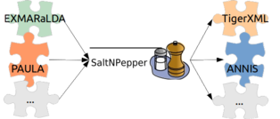

# ElanModules
This project provides an importer to support the [ELAN format](https://tla.mpi.nl/tools/tla-tools/elan/) in the linguistic converter framework Pepper (see https://github.com/korpling/pepper). A detailed description of that mapping can be found in section [ElanImporter](#details).

Pepper is a pluggable framework to convert a variety of linguistic formats (like [TigerXML](http://www.ims.uni-stuttgart.de/forschung/ressourcen/werkzeuge/TIGERSearch/doc/html/TigerXML.html), the [EXMARaLDA format](http://www.exmaralda.org/), [PAULA](http://www.sfb632.uni-potsdam.de/paula.html) etc.) into each other. Furthermore Pepper uses Salt (see https://github.com/korpling/salt), the graph-based meta model for linguistic data, which acts as an intermediate model to reduce the number of mappings to be implemented. That means converting data from a format _A_ to format _B_ consists of two steps. First the data is mapped from format _A_ to Salt and second from Salt to format _B_. This detour reduces the number of Pepper modules from _n<sup>2</sup>-n_ (in the case of a direct mapping) to _2n_ to handle a number of n formats.



In Pepper there are three different types of modules:
* importers (to map a format _A_ to a Salt model)
* manipulators (to map a Salt model to a Salt model, e.g. to add additional annotations, to rename things to merge data etc.)
* exporters (to map a Salt model to a format _B_).

For a simple Pepper workflow you need at least one importer and one exporter.

## Requirements
Since the here provided module is a plugin for Pepper, you need an instance of the Pepper framework. If you do not already have a running Pepper instance, click on the link below and download the latest stable version (not a SNAPSHOT):

> Note:
> Pepper is a Java based program, therefore you need to have at least Java 7 (JRE or JDK) on your system. You can download Java from https://www.oracle.com/java/index.html or http://openjdk.java.net/ .


## Install module
If this Pepper module is not yet contained in your Pepper distribution, you can easily install it. Just open a command line and enter one of the following program calls:

**Windows**
```
pepperStart.bat 
```

**Linux/Unix**
```
bash pepperStart.sh 
```

Then type in command *is* and the path from where to install the module:
```
pepper> update de.hu_berlin.german.korpling.saltnpepper::pepperModules-ElanModules::https://korpling.german.hu-berlin.de/maven2/
```

## Usage
To use this module in your Pepper workflow, put the following lines into the workflow description file. Note the fixed order of xml elements in the workflow description file: &lt;importer/>, &lt;manipulator/>, &lt;exporter/>. The ElanModules is an importer module, which can be addressed by one of the following alternatives.
A detailed description of the Pepper workflow can be found on the [Pepper project site](https://github.com/korpling/pepper). 

### a) Identify the module by name

```xml
<importer name="ElanImporter" path="PATH_TO_CORPUS"/>
```

### b) Identify the module by formats
```xml
<importer formatName="eaf" formatVersion="4.5.0" path="PATH_TO_CORPUS"/>
```

### c) Use properties
```xml
<importer name="ElanModules" path="PATH_TO_CORPUS">
  <property key="PROPERTY_NAME">PROPERTY_VALUE</property>
</importer>
```

## Contribute
Since this Pepper module is under a free license, please feel free to fork it from github and improve the module. If you even think that others can benefit from your improvements, don't hesitate to make a pull request, so that your changes can be merged.
If you have found any bugs, or have some feature request, please open an issue on github. If you need any help, please write an e-mail to saltnpepper@lists.hu-berlin.de .

## Funders
This project has been funded by the [department of corpus linguistics and morphology](https://www.linguistik.hu-berlin.de/institut/professuren/korpuslinguistik/) of the Humboldt-Universität zu Berlin, the Institut national de recherche en informatique et en automatique ([INRIA](www.inria.fr/en/)) and the [Sonderforschungsbereich 632](https://www.sfb632.uni-potsdam.de/en/). 

## License
  Copyright 2009 Humboldt-Universität zu Berlin, INRIA.

  Licensed under the Apache License, Version 2.0 (the "License");
  you may not use this file except in compliance with the License.
  You may obtain a copy of the License at
 
  http://www.apache.org/licenses/LICENSE-2.0

  Unless required by applicable law or agreed to in writing, software
  distributed under the License is distributed on an "AS IS" BASIS,
  WITHOUT WARRANTIES OR CONDITIONS OF ANY KIND, either express or implied.
  See the License for the specific language governing permissions and
  limitations under the License.


# <a name="details">ElanImporter</a>

For the moment, only Elan files without a linked media file and that only contain text-based annotations are properly handled. Moreover, the module has been developed within the framework of one specific project (Deutsch Diachron Digital), which may lead to some unexpected behavior when exposed to alien files. Nonetheless, the development of the mapping has been oriented towards generic functionality. In case of problems, please contact the developer.
The first step in the mapping to Salt consists of the creation of a so called STextualDS, which contains the complete text that is going to be annotated. The tier in Elan that holds the text is given by the user in the special properties.
The second step in the mapping to Salt consists of creating so-called STokens. These STokens are calculated on the basis of the tier in the list of segmentation-tiers that has the most amount of annotations (Note that this might be an assumption that does not hold for your files). The other tier(s) in the segmentation layer parameter is used to create (a) segmentation layer(s) that contains Salt Spans, which are given SOrderRelations (if wanted).
The actual mapping of the Elan annotations to Salt Annotations takes the simple form of a loop in a loop. For every tier in Elan, that tier is considered from left to right (i.e. from beginning to the end). For every encountered Elan annotation on the tier, a corresponding SSpan on the segmentation layer is searched. If an SSpan is found with an identical time slot, the annotation for the current tier is added to the SSpan. If the Elan annotation has no corresponding SSpan, it might be the case that the Elan annotation is a span of SSpans. If that is the case, the Elan annotation is added to this newly created span of SSpan. If the Elan annotation is shorter than all available SSpan, then this might be a subtoken, below the segmentation layer. Since we have all the STokens available, we can simply search for the (group of) STokens(s) that match the length of the Elan Annotation.

## Properties

 The table  contains an overview of all usable properties to customize the behavior of this pepper module. The following section contains a close description to each single property and describes the resulting differences in the mapping to the salt model.
 
|Name of property 					| Type of property	|optional/ mandatory|	default value|
|-----------------------------------|-------------------|-------------------|----------------|
| elan.importer.primTextTierName	| textual value		| mandatory |
| elan.importer.segTierNames 		| textual value		|mandatory	|
| elan.importer.ignoreTierNames		| textual value		|optional	|
| elan.importer.addSOrderRelation	| Boolean			|optional	|	true


### elan.importer.primTextTierName
Name of the tier containing the primary text. If the primary text is split out over multiple segments in Elan, then the values of all segments will be concatenated, including whitespace. The concatenated string is set as STextualDS in Salt. Only a single tiername is allowed in this property.

### elan.importer.segTierNames
Names of the tiers that will be used as segmentation layers. It is possible to only set a single segmentation layer. Segmentation layers are useful when there are subtoken annotations (i.e. annotations of parts in the STextualDS that are not typically considered as tokens), because it allows the end-user to select which segmentation he or she wants to see. Multiple tiernames are allowed in this property, and tiernames should be separated by commas.

### elan.importer.ignoreTierNames
Names of the tiers that will be ignored. Sometimes, specific Elan tiers are not needed in another format (e.g. annotator comments), and this parameter allows you to get rid of them. Obviously, these tiernames can not be in the previous two properties. Multiple tiernames are supported in this property, and tiernames should be separated by means of commas.

### elan.importer.addSOrderRelation
Determines if, this module shall add SOrderRelations to the segmentation layer(s). If only one segmentation layer is provided, no order relations are needed, and they will not be set. This property is default set to true, because it does not make much sense to have this to false.
